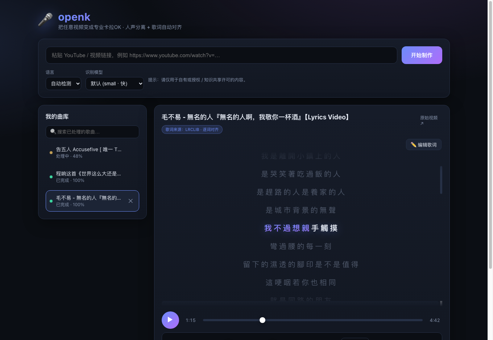
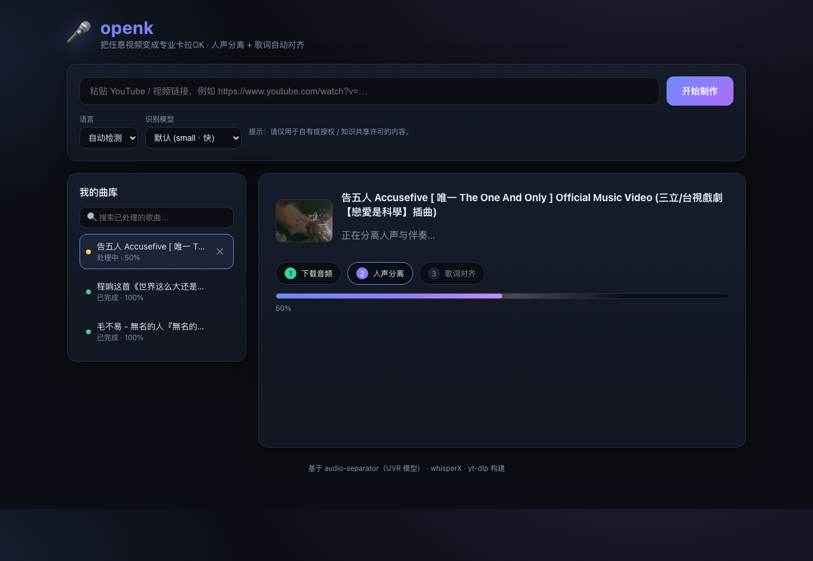
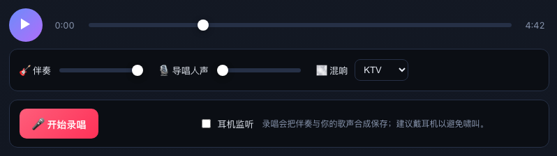

# 🎤 openk — 简单好用的专业卡拉OK

把任意 YouTube / 视频链接一键变成卡拉OK：**自动去除人声**、**逐字对齐歌词**，并提供带同步高亮歌词的播放器。

<p align="center">
  
  <br/>
  <sub>卡拉OK 播放器：逐字高亮歌词 · 独立伴奏/导唱音量 · KTV 混响 · 一键录唱 · 歌词来源标注</sub>
</p>

- 🎸 **人声分离**：基于 [audio-separator](https://github.com/nomadkaraoke/python-audio-separator)（[Ultimate Vocal Remover](https://github.com/Anjok07/ultimatevocalremovergui) 的 MDX-Net / BS-Roformer / Demucs 模型封装），在 Apple Silicon 上自动启用 CoreML 加速。
- 🎯 **优秀的歌词自动对齐**（多来源，自动择优）：
  1. **[LRCLIB](https://lrclib.net) 歌词库** —— 用歌名/艺人/时长精确匹配，直接拿到**准确、干净**的逐行时间戳歌词（免费、无需 key）。
  2. **YouTube 自带字幕**（官方 > 自动）—— 很多 MV 自带逐行时间戳歌词。
  3. 拿到歌词后交给 [whisperX](https://github.com/m-bain/whisperX) **强制对齐纯人声**，把逐行细化为**逐词**时间戳（卡拉OK级精度）。
  4. 若前面都没有，再用 whisperX **自动识别**兜底。
- ⬇️ **下载**：基于 [yt-dlp](https://github.com/yt-dlp/yt-dlp)。
- 🎚️ **卡拉OK播放器**：伴奏 / 导唱人声独立音量、进度拖动、逐字高亮、点歌词跳转、自动滚动、歌词来源标注。
- 🎙️ **录唱与回放**：麦克风 + 伴奏实时合成录制，内置多种**混响**（KTV / 小房间 / 大厅 / 教堂）；录音自动保存，可回放、下载、删除。
- 🗂️ **数据管理**：已处理的歌曲进曲库，可**搜索**；同一视频**自动去重**，不重复下载与分离；默认删除源音频以**节省空间**（只保留伴奏、人声与歌词，唱歌只看字幕、无需视频）。
- ✏️ **歌词可编辑**：识别偶有错字时可逐行手动修改，保存后**自动重建逐字时间轴**（未改动的行保留原有精确时间）。
- ↻ **失败一键重试**：下载 / 处理偶发失败（如 YouTube 限流）时，曲库项上会出现重试按钮；下载还内置自动退避重试。

> ⚠️ 请仅用于你**拥有版权或授权**（如知识共享许可）的内容。本项目不鼓励侵犯版权。

---

## 界面预览

**处理过程实时可见** —— 下载 → 人声分离 → 歌词对齐，三步流水线带进度：

<p align="center">
  
</p>

**混音与录唱** —— 伴奏 / 导唱人声独立音量、KTV 等多种混响、一键录唱与耳机监听：

<p align="center">
  
</p>

---

## 工作原理

```
YouTube 链接
   │  yt-dlp（音频 + 字幕 + 元数据）
   ▼
 原始音频 ──▶ audio-separator ──▶ 伴奏 (instrumental) ───────────────┐
                    │                                                │
                    └──▶ 纯人声 (vocals)                              │
                              │                                      │
   歌词文本来源（择优）：       │  强制对齐                             │
   LRCLIB ▸ YouTube字幕 ──────▶ whisperX.align ──▶ 逐词歌词 lyrics.json │
     （没有则 whisperX 自动识别兜底）                    │             │
                                                        ▼             ▼
              浏览器播放器：伴奏 + 可选导唱人声 + 逐字高亮歌词
```

两个关键设计：
- **歌词文本优先取自 LRCLIB / YouTube 字幕**（人工校对过，远比 ASR 识别准确），再用 whisperX 把它**强制对齐**到纯人声得到逐词时间戳。
- **先分离出纯人声再对齐/识别**，比直接处理混音准确得多。

## 目录结构

```
openk/
├── backend/
│   ├── main.py            # FastAPI 服务与路由
│   ├── config.py          # 配置（可用环境变量覆盖）
│   ├── jobs.py            # 任务管理（内存 + status.json 持久化）
│   ├── pipeline.py        # 下载→分离→对齐 编排
│   └── steps/
│       ├── download.py       # yt-dlp（音频 + 字幕 + 元数据）
│       ├── separate.py       # audio-separator（人声/伴奏分离）
│       ├── lyrics_sources.py # LRCLIB 查询 + VTT/SRT/LRC 解析 + 元数据清洗
│       ├── lyrics.py         # 歌词来源编排（择优 + 逐词对齐）
│       └── transcribe.py     # whisperX 强制对齐 / 识别 → lyrics.json / .lrc
├── frontend/              # 纯静态卡拉OK播放器 (HTML/CSS/JS)
├── scripts/               # seed_demo.py（演示曲）/ upgrade_word_align.py（逐字升级）
├── docs/screenshots/      # 界面截图（README 用）
├── requirements.txt       # 轻量依赖（Web + 下载）
└── requirements-ml.txt    # 重量依赖（分离 + 识别）
```

---

## 安装

需要 **Python 3.10–3.12**、**ffmpeg**，以及 **Deno**（YouTube 提取所需的 JS runtime）。

```bash
# 1) 系统依赖
brew install ffmpeg deno            # macOS（Linux 用 apt-get install ffmpeg + 参照 deno 官网）

# 2) 虚拟环境 + 轻量依赖
python3 -m venv .venv
source .venv/bin/activate
pip install -r requirements.txt
# 强烈建议把 yt-dlp 升级到 nightly（YouTube 反爬修复更快）：
pip install -U --pre "yt-dlp[default]"

# 3) 机器学习依赖（体积较大，会拉取 PyTorch 等）
pip install -r requirements-ml.txt
```

> **为什么需要 Deno？** YouTube 现在要求执行一段 JS 挑战（签名解密 / PO Token）才能拿到可下载的音频地址。
> yt-dlp 官方已把「无 JS runtime 的提取」标记为 **deprecated**，缺失它会导致 **HTTP 403 Forbidden**。
> Deno 是 yt-dlp 官方推荐的 JS runtime（见 [EJS wiki](https://github.com/yt-dlp/yt-dlp/wiki/EJS)）。

> Apple Silicon：`audio-separator[cpu]` 会自动使用 CoreML；whisperX 使用 CPU + int8（ctranslate2 暂不支持 MPS）。
> NVIDIA 显卡：改装 `audio-separator[gpu]`，并把 `OPENK_WHISPER_DEVICE=cuda`、`OPENK_WHISPER_COMPUTE_TYPE=float16`。

## 运行

```bash
./run.sh
# 或
python -m backend.main
```

浏览器打开 <http://127.0.0.1:8000> ，粘贴视频链接，点击「开始制作」。

### 先体验界面（无需 ML 依赖）

```bash
python scripts/seed_demo.py     # 生成一首合成演示曲
./run.sh
```

在页面左侧「我的曲库」打开 **openk 演示曲**，即可体验播放器、逐字高亮与导唱人声音量。

---

## 配置（环境变量）

| 变量 | 默认 | 说明 |
|------|------|------|
| `OPENK_WHISPER_MODEL` | `small` | 识别模型：`tiny/base/small/medium/large-v3` |
| `OPENK_WHISPER_LANGUAGE` | 空（自动） | 强制语言，如 `zh`、`en` |
| `OPENK_WHISPER_DEVICE` | `cpu` | `cpu` 或 `cuda` |
| `OPENK_WHISPER_COMPUTE_TYPE` | `int8` | `int8`（CPU）/ `float16`（GPU） |
| `OPENK_SEPARATOR_MODEL` | `UVR-MDX-NET-Inst_HQ_3.onnx` | UVR 模型；省内存较稳。设为空 `""` 用最高质量的 Roformer（需 16GB+） |
| `OPENK_SEPARATOR_SEGMENT_SIZE` | 空 | 减小可降低峰值内存（如 `128`），内存不足时用 |
| `OPENK_SEPARATOR_TIMEOUT` | `1200` | 分离超时秒数，超时报错而非无限卡住 |
| `OPENK_KEEP_SOURCE` | `false` | 分离后是否保留原始下载音频；默认删除以节省空间 |
| `OPENK_COOKIEFILE` | 空 | cookies.txt 路径，用于绕过 YouTube 机器人校验 / 限流 |
| `OPENK_PORT` | `8000` | 服务端口 |
| `OPENK_MAX_WORKERS` | `1` | 并发处理任务数 |

## 歌词方案与常见问题

**歌词来源如何选择？** 处理时自动按 `LRCLIB → YouTube 字幕 → whisperX 识别` 的优先级尝试，
播放器标题旁的徽章会标明本首歌词的实际来源（如「LRCLIB · 逐词对齐」）。

- **想要最准的歌词**：LRCLIB 覆盖了海量流行歌，命中时歌词文本最干净；再经 whisperX 逐词对齐即得卡拉OK级同步。
- **小众/无歌词的歌**：会自动退回 whisperX 对纯人声识别，仍能得到逐词歌词。
- **歌词只有整行高亮、没有逐字**：whisperX 逐词对齐依赖 NLTK 的 `punkt_tab` 资源，首次运行需联网下载；
  macOS 自带 Python 常因缺根证书报 `SSL: CERTIFICATE_VERIFY_FAILED`，程序已用 certifi 证书自动补齐（`_ensure_nltk_punkt`）。
  若此前已生成为整行歌词的旧任务，可就地升级为逐字（复用已分离人声，无需重下/重分离）：
  ```bash
  python -m scripts.upgrade_word_align <job_id>   # job_id 见曲库项或 data/jobs/ 目录
  ```
  升级后在浏览器刷新即可看到逐字高亮。
- **遇到 `HTTP 403 Forbidden` / 拿不到音频**：最常见原因是缺少 JS runtime。请确认已 `brew install deno`，且 yt-dlp 为 nightly（`pip install -U --pre "yt-dlp[default]"`）。
- **遇到 `HTTP 429` 或「Sign in to confirm you're not a bot」**：这是 YouTube 对频繁请求的限流。
  字幕抓取失败不会影响主流程（仍可用 LRCLIB）；若音频也无法下载，请配置 cookies：
  ```bash
  yt-dlp --cookies cookies.txt --cookies-from-browser chrome   # 或 firefox/safari
  export OPENK_COOKIEFILE=$PWD/cookies.txt
  ```

## API

| 方法 | 路径 | 说明 |
|------|------|------|
| POST | `/api/jobs` | 提交任务 `{url, language?, whisper_model?}`（同视频已处理则直接复用） |
| GET | `/api/jobs?q=` | 任务列表，`q` 可按标题搜索 |
| GET | `/api/jobs/{id}` | 任务状态（含媒体 URL 与录音列表） |
| DELETE | `/api/jobs/{id}` | 删除任务及其文件 |
| POST | `/api/jobs/{id}/recordings?duration=&title=` | 上传录音（请求体为音频字节） |
| GET | `/api/jobs/{id}/recordings` | 录音列表 |
| DELETE | `/api/jobs/{id}/recordings/{file}` | 删除单条录音 |
| GET | `/media/{id}/...` | 分离音频 / 歌词 / 录音（支持 Range） |

## 性能与内存

- ⚠️ **内存要求**：人声分离很吃内存，**建议 16GB 及以上**。8GB 机器（如 M1 Air）分离整首歌会很慢，
  甚至因内存不足导致模型卡死。请先**关闭浏览器等占内存的程序**再处理。
- **默认模型** `UVR-MDX-NET-Inst_HQ_3.onnx`（MDX-Net，走 onnxruntime/CoreML）比 BS-Roformer 更省内存、更稳；
  内存充足（16GB+）追求最高质量可设 `OPENK_SEPARATOR_MODEL=""` 用 Roformer。
- **卡住 / 内存不足的对策**：关闭其他大程序；减小段大小 `export OPENK_SEPARATOR_SEGMENT_SIZE=128`；
  分离超时默认 20 分钟（`OPENK_SEPARATOR_TIMEOUT`），超时会明确报错而不是无限卡在进度条上。
- CPU 上 `small` 识别模型较快；追求准确用 `medium`/`large-v3`，追求速度用 `tiny`。
- 歌词命中 LRCLIB / YouTube 字幕时只做一次**逐词对齐**，比完整识别快得多；同一视频**自动去重**，第二次秒开。
- 分离与对齐模型首次运行会自动下载，之后缓存复用。

## 致谢与许可

本项目站在这些优秀开源项目的肩膀上：
[Ultimate Vocal Remover](https://github.com/Anjok07/ultimatevocalremovergui) ·
[audio-separator](https://github.com/nomadkaraoke/python-audio-separator)（MIT） ·
[whisperX](https://github.com/m-bain/whisperX)（BSD-2） ·
[yt-dlp](https://github.com/yt-dlp/yt-dlp) ·
架构参考 [UltraSinger](https://github.com/rakuri255/UltraSinger)。

openk 代码以 MIT 许可发布。使用其中的模型时请遵守各自的许可与署名要求。
