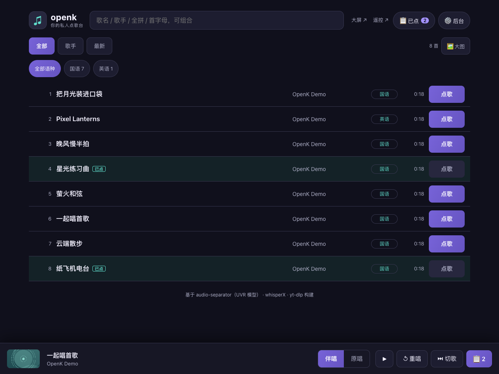

# 🎤 openk — 简单好用的专业卡拉OK

把任意 YouTube / 视频链接一键变成卡拉OK：**自动去除人声**、**逐字对齐歌词**，并提供带同步高亮歌词的播放器。

<p align="center">
  
  <br/>
  <sub>卡拉OK 播放器：逐字高亮歌词 · 独立伴奏/导唱音量 · KTV 混响 · 一键录唱 · 歌词来源标注</sub>
</p>

- 🎸 **人声分离**：基于 [audio-separator](https://github.com/nomadkaraoke/python-audio-separator)（[Ultimate Vocal Remover](https://github.com/Anjok07/ultimatevocalremovergui) 的 MDX-Net / BS-Roformer / Demucs 模型封装），在 Apple Silicon 上自动启用 CoreML 加速。
- 🎯 **优秀的歌词自动对齐**（多来源，自动择优）：
  1. **[LRCLIB](https://lrclib.net) 歌词库** —— 用歌名/艺人/时长精确匹配，直接拿到**准确、干净**的逐行时间戳歌词（免费、无需 key）。
  2. **YouTube 自带字幕**（官方 > 自动）—— 很多 MV 自带逐行时间戳歌词。
  3. 拿到歌词后交给 [whisperX](https://github.com/m-bain/whisperX) **强制对齐纯人声**，把逐行细化为**逐词**时间戳（卡拉OK级精度）。
  4. 若前面都没有，再用 whisperX **自动识别**兜底。
- ⬇️ **下载**：基于 [yt-dlp](https://github.com/yt-dlp/yt-dlp)。
- 🎚️ **卡拉OK播放器**：伴奏 / 导唱人声独立音量、进度拖动、逐字高亮、点歌词跳转、自动滚动、歌词来源标注。
- 🎙️ **录唱与回放**：麦克风 + 伴奏实时合成录制，内置多种**混响**（KTV / 小房间 / 大厅 / 教堂）；录音自动保存，可回放、下载、删除。
- 🗂️ **点歌台曲库**：已处理的歌曲进曲库，像 KTV 点歌台一样**按歌名 / 歌手搜索**、**按歌手分组**浏览（自动从标题 / LRCLIB 提取干净的歌名与歌手）；同一视频**自动去重**，不重复下载与分离；默认删除源音频以**节省空间**（只保留伴奏、人声与歌词，唱歌只看字幕、无需视频）。
- ✏️ **歌词可编辑**：识别偶有错字时可逐行手动修改，保存后**自动重建逐字时间轴**（未改动的行保留原有精确时间）。
- 🔍 **搜歌词、重对齐**：识别把语言认错（中文被唱成**拼音**、或整首识别成英文）时，一键从歌词库**搜索正确歌词并重新对齐**到人声——有时间轴的做逐字对齐、纯文本的按时长铺开；复用已分离音轨，不重新下载 / 分离。
- ↻ **失败一键重试**：下载 / 处理偶发失败（如 YouTube 限流）时，曲库项上会出现重试按钮；下载还内置自动退避重试。

> ⚠️ 请仅用于你**拥有版权或授权**（如知识共享许可）的内容。本项目不鼓励侵犯版权。

---

## 界面预览

**点歌台曲库** —— 干净的歌名 / 歌手、按歌手分组、支持搜歌名或歌手：

<p align="center">
  
</p>

**处理过程实时可见** —— 下载 → 人声分离 → 歌词对齐，三步流水线带进度：

<p align="center">
  
</p>

**混音与录唱** —— 伴奏 / 导唱人声独立音量、KTV 等多种混响、一键录唱与耳机监听：

<p align="center">
  
</p>

---

## 工作原理

```
YouTube 链接
   │  yt-dlp（音频 + 字幕 + 元数据）
   ▼
 原始音频 ──▶ audio-separator ──▶ 伴奏 (instrumental) ───────────────┐
                    │                                                │
                    └──▶ 纯人声 (vocals)                              │
                              │                                      │
   歌词文本来源（择优）：       │  强制对齐                             │
   LRCLIB ▸ YouTube字幕 ──────▶ whisperX.align ──▶ 逐词歌词 lyrics.json │
     （没有则 whisperX 自动识别兜底）                    │             │
                                                        ▼             ▼
              浏览器播放器：伴奏 + 可选导唱人声 + 逐字高亮歌词
```

两个关键设计：
- **歌词文本优先取自 LRCLIB / YouTube 字幕**（人工校对过，远比 ASR 识别准确），再用 whisperX 把它**强制对齐**到纯人声得到逐词时间戳。
- **先分离出纯人声再对齐/识别**，比直接处理混音准确得多。

图中 `audio-separator` 和 `whisperX` 两步吃掉了几乎全部算力，其余环节都很轻。
所以它们可以**整体挪到另一台机器上跑**（可选，默认不启用）——
常开的弱机器管 Web 和下载，算力机只在需要时上线干重活，见 [分布式部署](docs/distributed.md)。

## 目录结构

```
openk/
├── backend/
│   ├── main.py            # FastAPI 服务与路由
│   ├── config.py          # 配置（可用环境变量覆盖）
│   ├── jobs.py            # 任务管理（内存 + status.json 持久化）
│   ├── pipeline.py        # 下载→分离→对齐 编排
│   ├── remote/            # 可选：把重活分给远程算力机（见 docs/distributed.md）
│   │   ├── queue.py          # 任务队列（长轮询派发 + 租约回收）
│   │   ├── client.py         # 流水线侧入口：走远程还是本地
│   │   └── api.py            # /api/worker/* 接口
│   └── steps/
│       ├── download.py       # yt-dlp（音频 + 字幕 + 元数据）
│       ├── playlist.py       # 播放列表摊平（只读清单，不下载）
│       ├── separate.py       # audio-separator（人声/伴奏分离）
│       ├── lyrics_sources.py # LRCLIB 查询 + VTT/SRT/LRC 解析 + 元数据清洗
│       ├── lyrics.py         # 歌词来源编排（择优 + 逐词对齐）
│       └── transcribe.py     # whisperX 强制对齐 / 识别 → lyrics.json / .lrc
├── frontend/              # 纯静态卡拉OK播放器 (HTML/CSS/JS)
├── worker/                # 可选：远程算力 worker（跑在算力机上）
├── scripts/               # seed_demo.py（演示曲）/ upgrade_word_align.py（逐字升级）/ make_cert.py（自签证书）
├── deploy/                # 部署模板：环境变量、nginx TLS 反代、macOS 开机自启
├── docs/screenshots/      # 界面截图（README 用）
├── requirements.txt       # 轻量依赖（Web + 下载）
└── requirements-ml.txt    # 重量依赖（分离 + 识别）
```

---

## 用 Docker 运行（跨平台，最省事）

镜像已发布到 GitHub Container Registry，**内置 ffmpeg / Deno / Python 与全部依赖**，Mac / Windows / Linux 通用，只需装好 [Docker](https://docs.docker.com/get-docker/)：

```bash
docker run -d --name openk -p 8000:8000 \
  -v "$PWD/openk-data:/data" \
  ghcr.io/dcluomax/openk:latest
```

（Windows PowerShell 把挂载写成 `-v ${PWD}/openk-data:/data`。）打开 <http://localhost:8000> 即可使用；数据、录音与下载的模型都存在挂载的 `openk-data/` 里，重启不丢。

- 更新镜像：`docker pull ghcr.io/dcluomax/openk:latest`，再 `docker rm -f openk` 并重跑上面的命令。
- 传配置：追加 `-e OPENK_WHISPER_LANGUAGE=zh`、`-e OPENK_SEPARATOR_SEGMENT_SIZE=128` 等环境变量（见下方「配置」表）。
- ⚠️ 人声分离很吃内存，请在 Docker Desktop 的「Resources」里给容器**至少 6–8GB 内存**。
- 首次处理某首歌会联网下载模型（分离 / 识别 / 对齐），之后从 `openk-data` 缓存复用。
- 私有包免登录拉不到时：在仓库 **Packages → openk → Package settings** 把可见性改成 **Public**，或先 `docker login ghcr.io`。

> 镜像由 [GitHub Actions 工作流](.github/workflows/docker-publish.yml)在每次推送 `main` 时自动构建并发布（`linux/amd64` + `linux/arm64` 双架构）。

> **精简镜像**：把重活都交给远程 worker 时（见 [分布式部署](docs/distributed.md)），
> 服务端不再需要 torch / onnxruntime，可以自行构建一个不含 ML 依赖的镜像，
> 体积约从 5GB 降到 760MB：
> ```bash
> docker build --build-arg WITH_ML=0 -t openk:slim .
> ```

---

## 从源码安装

需要 **Python 3.10–3.12**、**ffmpeg**，以及 **Deno**（YouTube 提取所需的 JS runtime）。

```bash
# 1) 系统依赖
brew install ffmpeg deno            # macOS（Linux 用 apt-get install ffmpeg + 参照 deno 官网）

# 2) 虚拟环境 + 轻量依赖
python3 -m venv .venv
source .venv/bin/activate
pip install -r requirements.txt
# 强烈建议把 yt-dlp 升级到 nightly（YouTube 反爬修复更快）：
pip install -U --pre "yt-dlp[default]"

# 3) 机器学习依赖（体积较大，会拉取 PyTorch 等）
pip install -r requirements-ml.txt
```

> **为什么需要 Deno？** YouTube 现在要求执行一段 JS 挑战（签名解密 / PO Token）才能拿到可下载的音频地址。
> yt-dlp 官方已把「无 JS runtime 的提取」标记为 **deprecated**，缺失它会导致 **HTTP 403 Forbidden**。
> Deno 是 yt-dlp 官方推荐的 JS runtime（见 [EJS wiki](https://github.com/yt-dlp/yt-dlp/wiki/EJS)）。

> Apple Silicon：`audio-separator[cpu]` 会自动使用 CoreML；whisperX 使用 CPU + int8（ctranslate2 暂不支持 MPS）。
> NVIDIA 显卡：改装 `audio-separator[gpu]`，并把 `OPENK_WHISPER_DEVICE=cuda`、`OPENK_WHISPER_COMPUTE_TYPE=float16`。

## 运行

```bash
./run.sh
# 或
python -m backend.main
```

浏览器打开 <http://127.0.0.1:8000> ，粘贴视频链接，点击「开始制作」。

### 批量导入播放列表

粘贴歌单链接后点「🎵 导入歌单」，会先列出整个列表让你挑，确认后一次性排队：

- **不会白干**：曲库里已有的、正在排队的、已失效的、以及超过
  `OPENK_MAX_SONG_SECONDS` 的长视频，都在**下载之前**就标出来并默认不勾选；
  上次失败的会标成「可重来」，方便只补做失败的那几首。
- **重复点也安全**：同一个歌单导入两次，第二次一首都不会重复排队。
- **一次上限** 由 `OPENK_PLAYLIST_MAX_ITEMS` 控制（默认 100）；歌单更长时会如实提示被截断。
- 从歌单里点开某首歌复制的链接会带 `list=` 参数，直接点「开始制作」时页面会问一句
  要不要整个歌单导入，避免只做了一首。

> 只支持你自己能打开的普通歌单。YouTube 自动生成的电台 / 稍后观看（`RD`、`WL` 开头）
> 内容因账号而异，会被拒绝。私有歌单需要配 `OPENK_COOKIEFILE`。
>
> 歌单链接的 list ID 有 30 多个字符，**很容易在聊天软件里被换行截断**——
> 截断后 YouTube 的报错和「歌单不存在」一模一样，所以请从浏览器地址栏完整复制。

分离和识别都是按分钟计的重活，默认 `OPENK_MAX_WORKERS=1` 串行处理，
导入几十首后队列会慢慢消化，期间服务照常可用。

### 先体验界面（无需 ML 依赖）

```bash
python scripts/seed_demo.py     # 生成一首合成演示曲
./run.sh
```

在页面左侧「我的曲库」打开 **openk 演示曲**，即可体验播放器、逐字高亮与导唱人声音量。

---

## 配置（环境变量）

现成的模板在 `deploy/` 下，复制一份改就行（`docker run --env-file`、
systemd 的 `EnvironmentFile=` 都直接吃这个格式）：

```bash
cp deploy/openk.env.example  openk.env     # 服务端
cp deploy/worker.env.example worker.env    # 远程算力节点（可选）
```

### 存储路径

不设的话都在 `OPENK_DATA_DIR` 下面，也可以各自指到不同的盘。

| 变量 | 默认 | 说明 |
|------|------|------|
| `OPENK_DATA_DIR` | `<项目>/data` | 数据总目录 |
| `OPENK_JOBS_DIR` | `<data>/jobs` | 每首歌的音频、分离结果、歌词、录音；占空间的大头，可单独放 NAS |
| `OPENK_MODELS_DIR` | 空 | 模型缓存。**留空时 audio-separator 会写 `/tmp`**，有些系统重启就清空，每次都要重下几百 MB；设上之后 audio-separator / HuggingFace / torch 三处缓存一起跟着走 |
| `OPENK_CERTS_DIR` | `<data>/certs` | HTTPS 自签证书的存放位置 |
| `OPENK_FRONTEND_DIR` | `<项目>/frontend` | 前端静态文件目录 |

> 若你已经自己设过 `HF_HOME` / `TORCH_HOME` / `AUDIO_SEPARATOR_MODEL_DIR`，
> openk 不会覆盖它们，以你的设置为准。

### 处理与服务

| 变量 | 默认 | 说明 |
|------|------|------|
| `OPENK_WHISPER_MODEL` | `small` | 识别模型：`tiny/base/small/medium/large-v3` |
| `OPENK_WHISPER_LANGUAGE` | 空（自动） | 强制语言，如 `zh`、`en` |
| `OPENK_WHISPER_DEVICE` | `cpu` | `cpu` 或 `cuda` |
| `OPENK_WHISPER_COMPUTE_TYPE` | `int8` | `int8`（CPU）/ `float16`（GPU） |
| `OPENK_LYRICS_OFFSET_AUTO` | `true` | 对齐前自动校正歌词库与视频之间的整体时间轴偏移 |
| `OPENK_LYRICS_OFFSET_MAX` | `30` | 偏移搜索范围（秒），单向 |
| `OPENK_LYRICS_OFFSET_MIN` | `0.5` | 死区（秒）：小于它就当没偏移，避免动到本来就准的歌 |
| `OPENK_LYRICS_OFFSET_BLOCK` | `2.0` | 估偏移时每行按多长的「正在唱」计（秒），1~2.5 都稳 |
| `OPENK_LYRICS_ALIGN_PAD` | `0.35` | 送进 whisperX 的窗口左右余量（秒） |
| `OPENK_SEPARATOR_MODEL` | `UVR-MDX-NET-Inst_HQ_3.onnx` | UVR 模型；省内存较稳。设为空 `""` 用最高质量的 Roformer（需 16GB+） |
| `OPENK_SEPARATOR_SEGMENT_SIZE` | 空 | 减小可降低峰值内存（如 `128`），内存不足时用 |
| `OPENK_SEPARATOR_TIMEOUT` | `1200` | 分离超时秒数，超时报错而非无限卡住 |
| `OPENK_KEEP_SOURCE` | `false` | 分离后是否保留原始下载音频；默认删除以节省空间 |
| `OPENK_COOKIEFILE` | 空 | cookies.txt 路径，用于绕过 YouTube 机器人校验 / 限流 |
| `OPENK_PLAYLIST_MAX_ITEMS` | `100` | 批量导入播放列表时一次最多摊平多少首 |
| `OPENK_PLAYLIST_SKIP_LONG` | `true` | 导入前按列表里的时长先筛掉超过 `OPENK_MAX_SONG_SECONDS` 的项 |
| `OPENK_PORT` | `8000` | 服务端口 |
| `OPENK_HOST` | `127.0.0.1` | 监听地址；局域网访问填 `0.0.0.0` |
| `OPENK_MAX_WORKERS` | `1` | 并发处理任务数 |
| `OPENK_SSL_CERTFILE` | 空 | HTTPS 证书路径；与下一项同时设置才启用 |
| `OPENK_SSL_KEYFILE` | 空 | HTTPS 私钥路径 |

> **想用麦克风唱歌，就必须走 HTTPS。** 浏览器只在「安全上下文」下开放
> `getUserMedia`，`http://<局域网IP>` 不算，所以在别的设备上打开会提示无法录音。
> 详见下方 [启用 HTTPS](#启用-https)。

> 想把人声分离 / 歌词对齐挪到另一台算力更强的机器上跑，见
> **[分布式部署](docs/distributed.md)**（`OPENK_REMOTE_*` / `OPENK_WORKER_*` 系列变量）。
> 不配置时行为与单机版完全一致。

## 启用 HTTPS

麦克风、以及部分浏览器的音频 API，只在**安全上下文**（`https://` 或 `localhost`）下可用。
自己电脑上访问 `http://127.0.0.1:8000` 不受影响；但从手机 / 平板 / 另一台电脑连过来时，
必须启用 HTTPS，否则录音功能会被浏览器直接屏蔽。

**1. 生成自签证书**（把地址换成你自己的）：

```bash
python -m scripts.make_cert 192.168.1.10 myhost.local localhost 127.0.0.1
```

证书写到 `OPENK_CERTS_DIR`（默认 `<data>/certs`）。

> 证书的 SAN 里**必须包含你实际访问用的那个 IP**。只写域名的话，
> 用 IP 访问时即使点了「继续前往」，浏览器仍然不认为是安全上下文，麦克风照样打不开。

**2. 启动时指定证书**：

```bash
export OPENK_HOST=0.0.0.0
export OPENK_SSL_CERTFILE=~/.openk/certs/openk.crt
export OPENK_SSL_KEYFILE=~/.openk/certs/openk.key
python -m backend.main
```

浏览器首次打开会警告「不安全」——这是自签证书的正常现象，点高级 → 继续访问即可。

- **iOS / iPadOS**：Safari 需要先信任证书才能录音。把 `openk.crt` 传到设备上安装描述文件，
  再到 `设置 ▸ 通用 ▸ 关于本机 ▸ 证书信任设置` 里为它打开开关。
- **已有反向代理**（nginx / Caddy / Traefik）：不用改 openk，让代理终结 TLS 并转发到
  openk 的 HTTP 端口即可。这样 openk 与内网 worker 之间仍走明文 HTTP，
  不必给 worker 额外配置证书。现成的 nginx 配置见
  [`deploy/nginx-tls.conf.example`](deploy/nginx-tls.conf.example)——里面已经处理好了
  上传体积上限和媒体流缓冲这两个容易踩的点。

## 歌词方案与常见问题

**歌词来源如何选择？** 处理时自动按 `LRCLIB → YouTube 字幕 → whisperX 识别` 的优先级尝试，
播放器标题旁的徽章会标明本首歌词的实际来源（如「LRCLIB · 逐词对齐」）。

- **想要最准的歌词**：LRCLIB 覆盖了海量流行歌，命中时歌词文本最干净；再经 whisperX 逐词对齐即得卡拉OK级同步。
- **小众/无歌词的歌**：会自动退回 whisperX 对纯人声识别，仍能得到逐词歌词。
- **识别成拼音、整首英文、或错字太多**：多半是 whisperX 对纯人声轨**语言检测错了**（中文被误判成英文时会把唱词转写成拼音）。两种修法：① 提交前先在顶部**语言下拉选「中文」**；② 已处理的歌用播放器里的 **🔍 搜歌词、重对齐**——从 LRCLIB 搜到正确歌词一键重对齐（有时间轴的做逐字，纯文本的按时长铺开），或用 **✏️ 编辑歌词** 手动改。失败的歌也可先选好语言再点 ↻ 重试。
- **歌词整体早了/晚了几秒**：歌词库的时间轴对的是**录音室单曲**，而我们处理的是 YouTube 视频。
  官方 MV 常在歌曲前面加一段剧情、对白或环境音（Ed Sheeran《Shape of You》的 MV 就多了约 5.8 秒），
  两条时间轴于是整体错开。openk 会在对齐前先估出这个平移量并自动校正，
  worker 日志里能看到「歌词时间轴整体偏移 +5.90s」这类记录。
  校正范围和灵敏度可用 `OPENK_LYRICS_OFFSET_*` 调整，设 `OPENK_LYRICS_OFFSET_AUTO=false` 可完全关闭。
- **歌词只有整行高亮、没有逐字**：whisperX 逐词对齐依赖 NLTK 的 `punkt_tab` 资源，首次运行需联网下载；
  macOS 自带 Python 常因缺根证书报 `SSL: CERTIFICATE_VERIFY_FAILED`，程序已用 certifi 证书自动补齐（`_ensure_nltk_punkt`）。
  若此前已生成为整行歌词的旧任务，可就地升级为逐字（复用已分离人声，无需重下/重分离）：
  ```bash
  python -m scripts.upgrade_word_align <job_id>   # job_id 见曲库项或 data/jobs/ 目录
  ```
  升级后在浏览器刷新即可看到逐字高亮。
- **遇到 `HTTP 403 Forbidden` / 拿不到音频**：最常见原因是缺少 JS runtime。请确认已 `brew install deno`，且 yt-dlp 为 nightly（`pip install -U --pre "yt-dlp[default]"`）。
- **遇到 `HTTP 429` 或「Sign in to confirm you're not a bot」**：这是 YouTube 对频繁请求的限流。
  字幕抓取失败不会影响主流程（仍可用 LRCLIB）；若音频也无法下载，请配置 cookies：
  ```bash
  yt-dlp --cookies cookies.txt --cookies-from-browser chrome   # 或 firefox/safari
  export OPENK_COOKIEFILE=$PWD/cookies.txt
  ```

## API

| 方法 | 路径 | 说明 |
|------|------|------|
| POST | `/api/jobs` | 提交任务 `{url, language?, whisper_model?}`（同视频已处理则直接复用） |
| POST | `/api/playlists/preview` | 读取播放列表清单 `{url, limit?}`，标出每首在本地的状态；**不创建任务** |
| POST | `/api/playlists/import` | 批量导入 `{url, video_ids?, language?, whisper_model?, limit?}`；`video_ids` 留空＝导入全部可导入项 |
| GET | `/api/jobs?q=` | 任务列表，`q` 可按标题搜索 |
| GET | `/api/jobs/{id}` | 任务状态（含媒体 URL 与录音列表） |
| DELETE | `/api/jobs/{id}` | 删除任务及其文件 |
| POST | `/api/jobs/{id}/retry` | 重试失败任务（body 可选 `{language?, whisper_model?}` 覆盖语言/模型） |
| PUT | `/api/jobs/{id}/lyrics` | 保存手动编辑的歌词（重建逐字时间轴） |
| GET | `/api/lyrics/search?q=` | 在 LRCLIB 歌词库搜索候选歌词 |
| POST | `/api/jobs/{id}/lyrics/align` | 用选中的歌词库歌词重新对齐到人声 `{lrclib_id, language?}` |
| POST | `/api/jobs/{id}/recordings?duration=&title=` | 上传录音（请求体为音频字节） |
| GET | `/api/jobs/{id}/recordings` | 录音列表 |
| DELETE | `/api/jobs/{id}/recordings/{file}` | 删除单条录音 |
| GET | `/media/{id}/...` | 分离音频 / 歌词 / 录音（支持 Range） |

启用[分布式部署](docs/distributed.md)后额外提供（均需 `Authorization: Bearer <OPENK_WORKER_TOKEN>`）：

| 方法 | 路径 | 说明 |
|------|------|------|
| POST | `/api/worker/claim` | worker 长轮询领取任务；无任务返回 `204` |
| POST | `/api/worker/tasks/{id}/progress` | 上报进度，同时续租 |
| POST | `/api/worker/tasks/{id}/finish` | 提交结果或错误 |
| GET | `/api/worker/status` | 队列与 worker 在线情况（排查用） |

## 性能与内存

- ⚠️ **内存要求**：人声分离很吃内存，**建议 16GB 及以上**。8GB 机器（如 M1 Air）分离整首歌会很慢，
  甚至因内存不足导致模型卡死。请先**关闭浏览器等占内存的程序**再处理。
  机器实在带不动、但手头有另一台算力更强的机器时，可以把分离和对齐**整个挪过去**跑，
  见 [分布式部署](docs/distributed.md)。
- **默认模型** `UVR-MDX-NET-Inst_HQ_3.onnx`（MDX-Net，走 onnxruntime/CoreML）比 BS-Roformer 更省内存、更稳；
  内存充足（16GB+）追求最高质量可设 `OPENK_SEPARATOR_MODEL=""` 用 Roformer。
- **卡住 / 内存不足的对策**：关闭其他大程序；减小段大小 `export OPENK_SEPARATOR_SEGMENT_SIZE=128`；
  分离超时默认 20 分钟（`OPENK_SEPARATOR_TIMEOUT`），超时会明确报错而不是无限卡在进度条上。
- CPU 上 `small` 识别模型较快；追求准确用 `medium`/`large-v3`，追求速度用 `tiny`。
- 歌词命中 LRCLIB / YouTube 字幕时只做一次**逐词对齐**，比完整识别快得多；同一视频**自动去重**，第二次秒开。
- 分离与对齐模型首次运行会自动下载，之后缓存复用。

## 致谢与许可

本项目站在这些优秀开源项目的肩膀上：
[Ultimate Vocal Remover](https://github.com/Anjok07/ultimatevocalremovergui) ·
[audio-separator](https://github.com/nomadkaraoke/python-audio-separator)（MIT） ·
[whisperX](https://github.com/m-bain/whisperX)（BSD-2） ·
[yt-dlp](https://github.com/yt-dlp/yt-dlp) ·
架构参考 [UltraSinger](https://github.com/rakuri255/UltraSinger)。

openk 代码以 MIT 许可发布。使用其中的模型时请遵守各自的许可与署名要求。
