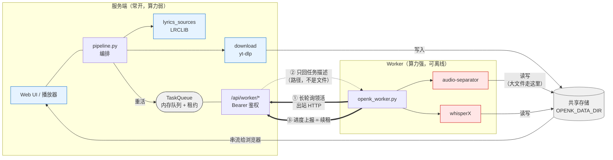

# 分布式部署：把算力拆到另一台机器

openk 默认是单机的，**这份文档描述的一切都是可选的**。不配置任何 `OPENK_REMOTE_*`
变量时，行为与旧版本完全一致（所有步骤在本机跑）。

## 为什么要拆

openk 的流水线里，重活和轻活的资源画像截然不同：

| 步骤 | 吃什么 | 时长量级 |
|------|--------|----------|
| 下载（yt-dlp）、查歌词（LRCLIB）、Web/播放器 | 带宽、少量内存 | 秒级 |
| **人声分离**（audio-separator） | **CPU/GPU + 大内存** | 分钟级 |
| **强制对齐 / 识别**（whisperX） | **CPU/GPU + 大内存** | 分钟级 |

于是很自然地想把重活挪走。典型场景：

- 一台**常开但算力弱**的机器（NAS、小主机、云上小机器）跑服务端，负责 Web、下载和串流；
- 一台**算力强但不常开**的机器（有独显的台式机、Apple Silicon 的 Mac）只在需要时处理重活。

## 设计：worker 主动拉，服务端从不推



关键点：**箭头①②③全部由 worker 发起**。服务端不持有 worker 地址、不开出站连接、
不做健康检查。这带来三个直接好处：

1. **worker 可以随时离线**。它只是不再来领活；服务端毫无察觉，也不需要察觉。
2. **worker 不必有公网/固定地址**，不用开任何入站端口，NAT 和防火墙后面也能跑。
3. **家用网络的入站方向本来就脆**（机器休眠、换网段、DHCP 变动、macOS 的本地网络授权），
   而出站长连接稳定得多。

### 大文件不走网络

任务消息里传的是**路径**而不是音频字节。两端通过共享存储（NFS / SMB / 同一台机器的
bind mount）看到同一个 `OPENK_DATA_DIR`；worker 拿到路径后直接读写。
一首歌的原始音频 + 分离产物往往上百 MB，走消息队列传是纯粹的浪费。

两端挂载点名字不同时（例如服务端是 `/data`、worker 上是 `/mnt/nas/openk`），
用 `OPENK_WORKER_PATH_MAP` 做转换即可，见下。

## 可靠性是怎么保证的

### 租约（lease）：worker 挂了，活不会丢

worker 领走任务时会拿到一个**租约**（默认 120s）。它必须靠上报进度不断续租；
一旦断电、被 kill、网络中断，租约到期后服务端的回收线程会把任务**重新排队**，
另一个 worker（或它自己重启后）会接着做。

重排不等于从头再来：`pipeline.py` 本来就会检查已落盘的分离结果并跳过，
所以重试是**接着做**而不是**重做**。

```
worker A 领走 ──▶ 进度 30% ──▶ ✕ 断电
                                 │ 租约到期（≤120s）
                                 ▼
                          服务端自动重新排队
                                 │
worker B（或 A 重启）领走 ──▶ 发现人声已分离，跳过 ──▶ 继续对齐 ──▶ 完成
```

掉线的 worker 即使复活后再上报，也会被拒绝（任务已不属于它），不会污染状态。

### 独立心跳：长时间不出声的步骤不会被误判

强制对齐这类步骤可能几分钟只报一次进度，中间的静默期容易超过租约。
worker 因此另起一个**心跳线程**（默认 30s）单独续租，与进度上报互不依赖。

### worker 离线时的表现

任务停在队列里，前端显示「已排队，等待处理节点上线…」。
**曲库浏览和已处理歌曲的播放完全不受影响**——那些只需要读共享存储。
worker 一上线，积压的任务立刻开始处理（长轮询让派发延迟接近 0）。

如果希望「等太久就报错」而不是无限等待，设置 `OPENK_REMOTE_WAIT_TIMEOUT`（秒）。

## 配置

### 服务端

| 变量 | 默认 | 说明 |
|------|------|------|
| `OPENK_REMOTE_STEPS` | 空 | 交给远程 worker 的步骤，逗号分隔：`separate,transcribe,align`。**空 = 全部本地处理（默认行为）** |
| `OPENK_WORKER_TOKEN` | 空 | worker 鉴权口令。**启用远程时务必设置**，否则同网段任何人都能领任务 |
| `OPENK_WORKER_LEASE_SECONDS` | `120` | 租约时长；超时未续租则任务重排 |
| `OPENK_WORKER_OFFLINE_AFTER` | `90` | 多久没见到 worker 就认为它离线（仅用于状态显示） |
| `OPENK_REMOTE_WAIT_TIMEOUT` | `0` | 等待 worker 的上限秒数，`0` = 无限等（推荐） |
| `OPENK_REMOTE_FALLBACK_LOCAL` | `false` | 无 worker 时是否退回本机计算。服务端算力弱时**保持 `false`** |

`OPENK_REMOTE_STEPS` 的三个值：

- `separate` —— 人声/伴奏分离（audio-separator）
- `align` —— 已有歌词文本时的**强制对齐**（whisperX align）。命中 LRCLIB 时走这条，是最常见的路径
- `transcribe` —— 无歌词时的完整语音识别（whisperX transcribe）

三者可以分别开关。只想挪走最重的分离，就设 `OPENK_REMOTE_STEPS=separate`。

> **三个都开启后，服务端不再需要 torch / onnxruntime**，可以用
> `docker build --build-arg WITH_ML=0` 构建精简镜像（体积从 ~5GB 降到 ~760MB）。

### Worker

| 变量 | 默认 | 说明 |
|------|------|------|
| `OPENK_SERVER` | `http://127.0.0.1:8000` | 服务端地址 |
| `OPENK_WORKER_TOKEN` | 空 | 必须与服务端一致 |
| `OPENK_WORKER_ID` | 主机名 | 日志和状态接口里的标识 |
| `OPENK_WORKER_KINDS` | `separate,transcribe,align` | 本机愿意接的任务类型；算力有限时可只接一部分 |
| `OPENK_WORKER_PATH_MAP` | 空 | 共享存储路径转换，`服务端路径=本机路径`，多组用 `,` 分隔 |
| `OPENK_WORKER_STAGE_LOCAL` | `true` | 先把输入拷到本机临时盘再算。网络存储上强烈建议保持开启 |
| `OPENK_WORKER_POLL_WAIT` | `25` | 长轮询挂起秒数 |
| `OPENK_WORKER_HEARTBEAT` | `30` | 心跳续租间隔 |
| `OPENK_MODELS_DIR` | 空 | 模型缓存目录。留空时 audio-separator 会写 `/tmp`，重启可能被清空；模型有好几 GB，建议指到持久盘 |

现成模板：[`deploy/worker.env.example`](../deploy/worker.env.example)、
[`deploy/openk.env.example`](../deploy/openk.env.example)。

worker 还需要装好 ML 依赖（`requirements.txt` + `requirements-ml.txt`），
以及 ffmpeg——它才是真正干活的那台。

## 上手

假设服务端在 `nas.local`，共享目录在服务端是 `/data`、在 worker 上挂载为 `/mnt/nas/openk`。

### 1. 起服务端

```bash
# 先生成一个口令，两端都要用
openssl rand -hex 24 > worker-token.txt

docker run -d --name openk -p 8000:8000 \
  -v /srv/openk-data:/data \
  -e OPENK_REMOTE_STEPS=separate,transcribe,align \
  -e OPENK_WORKER_TOKEN="$(cat worker-token.txt)" \
  openk:slim     # 或 ghcr.io/dcluomax/openk:latest
```

精简镜像（不含 torch，仅在三个步骤都远程时可用）：

```bash
docker build --build-arg WITH_ML=0 -t openk:slim .
```

### 2. 起 worker

在算力机上（需要已装好 ML 依赖，见主 README 的「从源码安装」）：

```bash
export OPENK_SERVER=http://nas.local:8000
export OPENK_WORKER_TOKEN=<与服务端相同>
export OPENK_WORKER_PATH_MAP=/data=/mnt/nas/openk
python worker/openk_worker.py
```

看到这两行就说明连上了：

```
[worker 12:07:17] worker=<主机名> server=http://nas.local:8000 kinds=separate,transcribe,align
[worker 12:07:17] 路径映射：/data → /mnt/nas/openk
```

### 3. 确认

```bash
curl -H "Authorization: Bearer $TOKEN" http://nas.local:8000/api/worker/status
```

```json
{
  "online": true,
  "workers": [{"id": "gpu-box", "online": true, "idle_seconds": 3.1,
               "kinds": ["separate", "transcribe", "align"]}],
  "waiting": 0,
  "running": [],
  "remote_steps": ["align", "separate", "transcribe"]
}
```

之后照常提交歌曲即可，重活会自动落到 worker 上。

## 开机自启

### systemd（Linux worker）

`/etc/systemd/system/openk-worker.service`：

```ini
[Unit]
Description=openk remote worker
After=network-online.target remote-fs.target
Wants=network-online.target

[Service]
User=openk
WorkingDirectory=/opt/openk
EnvironmentFile=/etc/openk/worker.env
ExecStart=/opt/openk/.venv/bin/python worker/openk_worker.py
Restart=always
RestartSec=10

[Install]
WantedBy=multi-user.target
```

```bash
sudo systemctl enable --now openk-worker
```

### launchd（macOS worker）

`~/Library/LaunchAgents/org.openk.worker.plist`：

```xml
<?xml version="1.0" encoding="UTF-8"?>
<!DOCTYPE plist PUBLIC "-//Apple//DTD PLIST 1.0//EN"
  "http://www.apple.com/DTDs/PropertyList-1.0.dtd">
<plist version="1.0">
<dict>
  <key>Label</key><string>org.openk.worker</string>
  <key>ProgramArguments</key>
  <array>
    <string>/bin/sh</string><string>-c</string>
    <string>set -a; . "$HOME/openk/worker.env"; set +a; cd "$HOME/openk"; exec "$HOME/openk/.venv/bin/python" worker/openk_worker.py</string>
  </array>
  <key>EnvironmentVariables</key>
  <dict>
    <key>PATH</key>
    <string>/opt/homebrew/bin:/opt/homebrew/sbin:/usr/bin:/bin:/usr/sbin:/sbin</string>
  </dict>
  <key>RunAtLoad</key><true/>
  <key>KeepAlive</key><true/>
  <key>StandardOutPath</key><string>/tmp/openk-worker.log</string>
  <key>StandardErrorPath</key><string>/tmp/openk-worker.log</string>
</dict>
</plist>
```

```bash
launchctl bootstrap gui/$(id -u) ~/Library/LaunchAgents/org.openk.worker.plist
```

> 两个容易踩的点：
> 1. launchd **不继承登录 shell 的环境变量**，所以用 `worker.env` 文件传配置，
>    并把它 `chmod 600`（里面有口令）。
> 2. 上面是 `sh -c` 而**不是** `sh -lc`。加 `-l` 会走登录 shell，触发
>    `path_helper` 重建 PATH，把 `EnvironmentVariables` 里设的 PATH 直接冲掉，
>    结果就是 ffmpeg 找不到、分离阶段莫名其妙地失败。
>    worker 启动时会自检 ffmpeg/ffprobe，缺了会在日志里直接点名。

### macOS worker：重启之后自己回来

上面那份 plist 只解决了「登录之后自启」。**机器重启且没人登录时，它不会跑。**
worker 停在那里，服务端只会显示 worker 离线，任务一直排队。

要做到无人干预自恢复，得凑齐三件事：

**1. 共享存储要在 worker 之前就绪。**
开机后 worker 很可能比挂载先起来，对着还不存在的路径反复报错。
用 [`deploy/ensure-mount.sh.example`](../deploy/ensure-mount.sh.example) 挡在前面：
它只**等待**挂载出现，等不到就退出，交给 `KeepAlive` 退避重试。

挂载本身交给系统既有的登录项（macOS 上用 `open smb://…`，走钥匙串凭据），
不要在磁盘上另存一份密码。

> **两个代价很高的坑**，都是实测撞出来的：
>
> **别把挂载点放在 `$HOME` 里面。** 家目录会被各种 CLI、编辑器、索引器递归扫描。
> 一旦扫进一个几十 TB 的网络共享，进程就会永久卡在 `opendir()` 上——
> 而且现象极具迷惑性：**0% CPU、没有任何 TCP 连接、日志停在启动阶段**，
> 看起来像死锁或者网络故障，实际是 SMB 目录遍历在内核里等 I/O。
> 挂到 `/Volumes/…` 这类家目录之外的位置就没事。
>
> **别为了「可控」另起一个 `mount_smbfs` 把同一个共享挂到第二个位置。**
> macOS 不允许同一共享挂两次，后挂的会一直报 `File exists`；
> 就算绕开了，两份挂载点也会让路径映射产生歧义。

**2. 要有一个已登录的图形会话。**
worker 连的是局域网地址，macOS 15+ 的「本地网络」隐私授权需要一次 GUI 确认，
而 LaunchDaemon 开机时没有会话可以弹窗——这就是这里用 LaunchAgent + 自动登录、
而不是改成 LaunchDaemon 的原因。挂载用的 `open smb://` 同样需要图形会话。

```bash
# 前提：FileVault 必须关闭，否则开机要先解锁磁盘，自动登录无从谈起
fdesetup status

sudo defaults write /Library/Preferences/com.apple.loginwindow autoLoginUser <用户名>
# 还需要写 /etc/kcpassword（口令与固定密钥异或，不是加密）；
# 图形界面里「系统设置 → 用户与群组 → 自动登录」勾一下更省事

# 自动登录会让机器开机即进桌面，所以立刻上锁，
# 把「无人值守可用」和「有人在场可进」分开
sudo sysadminctl -screenLock immediate -password -
```

> 这是有安全代价的：`/etc/kcpassword` 能被 root 或任何能读盘的人还原成明文。
> 不过如果 FileVault 本来就是关的，物理接触者早就能读全盘了，
> 自动登录带来的**额外**风险接近于零。反过来说，
> 如果你开着 FileVault，就不该走这条路，也走不通。

**3. 断电之后要自己开机。**

```bash
sudo pmset -a autorestart 1   # 来电后自动开机
sudo pmset -a sleep 0         # 别睡过去
```

配好后**一定要真重启一次验证**，别只看配置项：

```bash
sudo shutdown -r now
# 等一两分钟，然后从服务端确认，而不是从这台机器上看
curl -s http://<服务端>:8000/api/worker/status
```

现成模板：[`deploy/org.openk.worker.plist.example`](../deploy/org.openk.worker.plist.example)。

## 排查

| 现象 | 原因 | 处理 |
|------|------|------|
| 任务卡在「等待处理节点上线…」 | worker 没连上 | 查 `/api/worker/status` 的 `online`；看 worker 日志 |
| worker 日志刷 `401` | 口令不一致 | 核对两端 `OPENK_WORKER_TOKEN` |
| worker 报文件不存在 | 路径映射不对 | 核对 `OPENK_WORKER_PATH_MAP`；确认共享存储已挂载且**可写** |
| worker 报权限不足 | 两端 uid 对不上 | 见下方「共享存储的属主」 |
| 任务反复重排、`attempts` 递增 | worker 中途死掉，或租约太短 | 看 worker 日志有无 OOM；调大 `OPENK_WORKER_LEASE_SECONDS` |
| 分离极慢 | 直接在网络存储上做随机读写 | 确认 `OPENK_WORKER_STAGE_LOCAL=true` |
| 分离报 `Separation produced no output files` | 找不到 ffmpeg，或 librosa 版本过新 | 见 worker 启动自检的日志；确认 `librosa<1.0` |
| 分离报 `Format not recognised` | librosa ≥1.0 移除了 audioread 回退，读不了 webm/m4a | `pip install "librosa<1.0"` |
| 服务端启动报缺 torch | 用了精简镜像但没开满三个远程步骤 | 补全 `OPENK_REMOTE_STEPS`，或用完整镜像 |
| 浏览器提示「当前浏览器不支持麦克风」 | 用 `http://` + 局域网 IP 访问，不是安全上下文 | 启用 HTTPS，见下方 |

### 加了 HTTPS 之后 worker 怎么连

给浏览器上 TLS 有两种做法，对 worker 的影响不一样：

- **反向代理终结 TLS（推荐）**：nginx / Caddy 监听 443，转发到 openk 的 HTTP 端口。
  浏览器走 HTTPS，worker 继续用 `OPENK_SERVER=http://<内网IP>:<HTTP端口>` 直连，
  两边互不干扰，worker 不需要处理自签证书。注意把 `client_max_body_size` 调大，
  并对媒体流关掉 `proxy_buffering`（Range 请求被缓冲会导致播放卡顿）。
- **openk 自己开 TLS**（`OPENK_SSL_CERTFILE` / `OPENK_SSL_KEYFILE`）：此时只有 HTTPS 一个入口，
  `OPENK_SERVER` 也得改成 `https://…`。自签证书 Python 默认不信任，
  需要给 worker 进程设 `SSL_CERT_FILE=/path/to/openk.crt` 指向同一份证书。

### macOS worker：`No route to host`，但手动跑就是通的

如果 worker 手动在终端里跑得好好的，一交给 launchd 托管就一直：

```
连不上服务端（<urlopen error [Errno 65] No route to host>）；60s 后重试
```

而同一台机器上 `curl http://<服务端>:8000/api/jobs` 明明返回 200 —— 这**不是网络问题**，
是 macOS 的**「本地网络」隐私授权**被拒。被拒时系统返回的正是 `EHOSTUNREACH`，
和真正的路由不可达长得一模一样，非常容易查错方向。

判据很清楚：**新起的短命进程能通、长驻的后台进程不通**。
手动运行时进程继承了终端已获得的授权；launchd 托管的进程是独立身份，需要单独授权。

处理：**系统设置 ▸ 隐私与安全性 ▸ 本地网络**，打开对应 Python 的开关
（openk 的 worker 以解释器身份登记，通常显示为 `Python`）。
列表里没有条目时，先在终端手动跑一次 `python worker/openk_worker.py` 触发登记。

> 换成系统级 LaunchDaemon **绕不过**这个限制，而且 daemon 看不到登录会话里的
> SMB/AFP 挂载点，共享存储会直接消失。用 LaunchAgent + 授权才是正解。

### 共享存储的属主

服务端跑在容器里时默认是 root，创建出来的作业目录属主是 `0:0`；
worker 通过 NFS/SMB 以普通用户身份访问，就会 `Permission denied`。

让容器以共享存储上的那个 uid 运行即可：

```bash
docker run ... --user 3000:3000 -e HOME=/data ...
```

已经写坏的目录可以借一个 root 容器修回来：

```bash
docker run --rm --user 0:0 -v /srv/openk-data:/data openk:slim chown -R 3000:3000 /data
```

### 只读挂载的媒体目录还要带上附加组

启用本地媒体导入时，被挂进去的媒体目录往往属于另一个组（NAS 上常见的
`homeGroup` 之类），靠**组权限**而不是属主授权。`--user 3000:3000` 只带 uid/gid，
**不会**带上该用户在宿主机上的附加组，于是容器里 `ls` 那个目录就是 `Permission denied`，
表现成扫描不到文件、或导入后每首都报「路径不存在，或不在允许的媒体目录内」。

把宿主机上那个组显式加进来即可（`id <用户>` 可以查到该带哪些 gid）：

```bash
docker run ... --user 3000:3000 --group-add 1000 \
  -v /mnt/pool/Media/ktv:/media/ktv:ro -e OPENK_LOCAL_MEDIA_DIRS=/media/ktv ...
```

## 安全边界

`/api/worker/*` 由 `OPENK_WORKER_TOKEN` 做 Bearer 鉴权，**没有 TLS**。
这套设计的预期部署环境是**可信的局域网**。要跨公网使用，请套一层
WireGuard / Tailscale，或在前面放个 TLS 反代——不要直接把这些端口暴露到公网。

## 自测

```bash
python test_remote.py
```

覆盖：任务往返、类型过滤、**worker 离线时排队而非失败**、状态上报、
**租约到期自动重排**、路径映射边界、HTTP 层鉴权与全链路。

```bash
python test_lyrics.py
```

覆盖歌词时间轴校正：能否找回已知偏移、**时间轴本来就准时不乱动**、
**歌词库把 end 补成下一行起点时依然估得准**（这是实测踩到的坑）、
输入异常时安全退化。用合成音频，不需要 torch / whisperX。

```bash
python test_config.py
```

覆盖存储路径的可配置性：**不设环境变量时行为与以前完全一致**、
各目录能否单独指到不同的盘、`OPENK_MODELS_DIR` 是否把三个库的缓存一并带走、
用户已有的 `HF_HOME` 会不会被覆盖。

```bash
python test_playlist.py
```

覆盖播放列表批量导入：链接解析、**同一歌单导入两次不会重复排队**（幂等）、
已有 / 排队中 / 失效 / 超长项在下载前就被挡下、勾选式部分导入、
`OPENK_PLAYLIST_MAX_ITEMS` 上限夹取，以及**链接被截断时的提示是否可操作**。
用假的 yt-dlp 作答，不联网、也不需要装 yt-dlp。

```bash
python test_local_media.py
```

覆盖本地媒体导入，重点在**安全边界**：未配置白名单时功能是否真的关着（404 而非 403）、
白名单外的绝对路径 / `../` 穿越 / **指向外部的软链接**是否都被拒、非媒体后缀是否被拒、
文件名里的 11 位视频 ID 能否正确解析（`[Official MV]` 这类方括号不能误判成 ID）、
以及**重启续跑**：queued/running 的任务重启后回到 queued 而不是 error，并且只会被重排一次。
