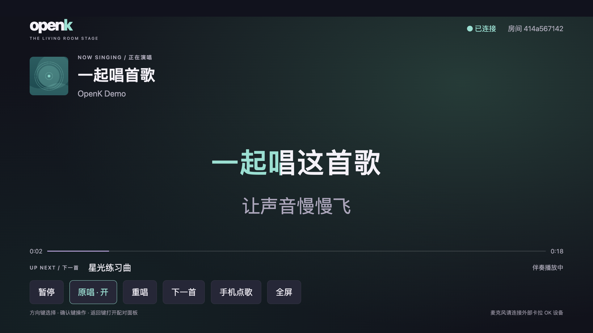
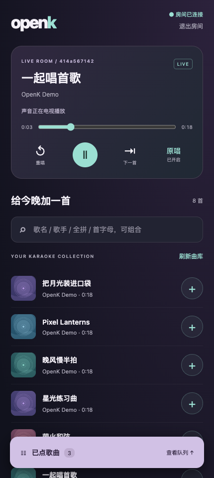
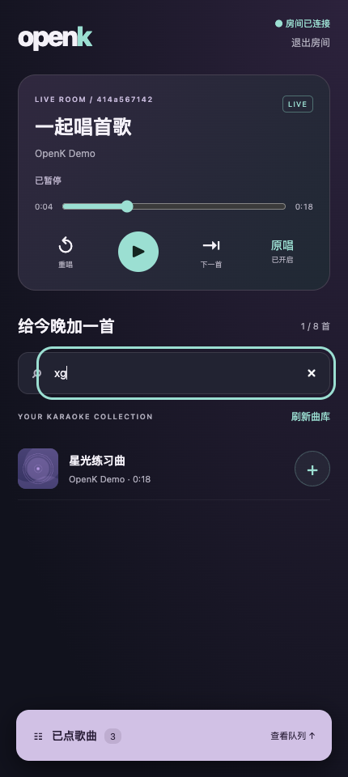
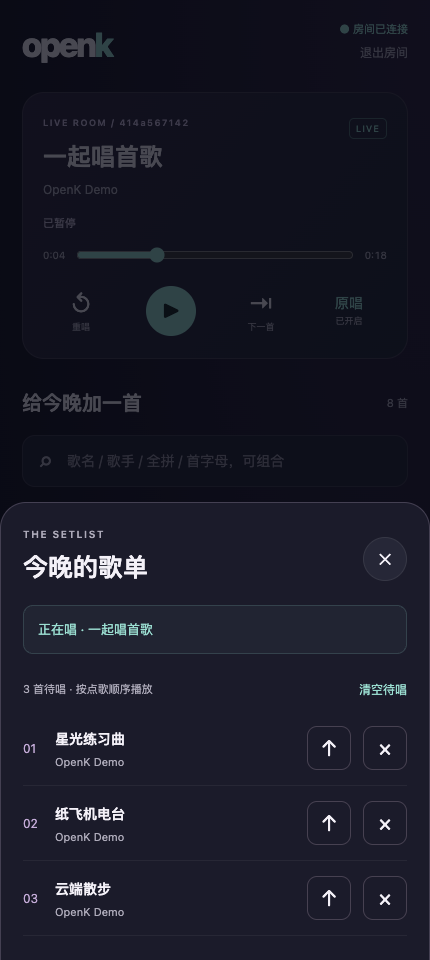

# 电视舞台与手机点歌

OpenK 保留经典单机点歌台，并增加共享房间。新界面不改变媒体存储位置：
歌曲、伴奏、歌词和录音仍在服务端；电视流式播放，手机只负责控制。

| 入口 | 用途 |
| --- | --- |
| `/` | 经典点歌台，浏览器自己的本地队列与麦克风、录唱 |
| `/tv` | 电视舞台、双轨播放、当前与下一句歌词 |
| `/remote` | 手机配对、搜索、共享队列、暂停、切歌与原唱切换 |
| `/admin` | 打开经典界面的管理抽屉，导入与维护曲库 |

<p></p>
<p></p>

截图使用虚构曲目、原创示例歌词和合成音轨。组合搜索与待唱队列：

<p>
</p>

## 开始演唱

1. 电视和手机连接能访问 OpenK 的网络，电视打开 `/tv`。
2. 手机扫描电视上的二维码，或打开 `/remote` 填写房间号和六位配对码。
3. 手机上选择歌曲；电视上按一次「启用电视声音」，满足浏览器的用户手势要求。
4. 之后手机可继续点歌、调整队列和控制播放。声音只从电视输出。

二维码在本地生成，不会向第三方发送服务器地址或配对信息。手机配对凭据
保存在该浏览器本地；刷新后可恢复。经典点歌台原有的 localStorage 队列
不会自动导入房间，以免升级后突然播放此前的歌曲。

房间队列由服务端保存，命令带唯一编号避免网络重试导致重复点歌。
一个房间同时只有一个获得有效租约的电视播放器；歌曲结束也必须由这个
播放器确认，过期页面不能擅自切掉另一台电视正在唱的歌。

## Fire TV

可在支持 Silk 浏览器的型号上尝试网页入口；不同 Fire TV 型号与浏览器版本的
媒体、全屏、方向键行为存在差异，不能把桌面 Chrome 结果当作 Fire TV 实机结果。

舞台采用大字号、低信息密度、边缘安全区和明确焦点。用方向键移动、
确认键操作；返回键用于关闭浮层或显示控制。全屏能力不可用时，仍可在
浏览器页面内演唱。

电视模式不申请麦克风权限，也不依赖遥控器麦克风。现场演唱建议使用
外置卡拉 OK 麦克风、混音器和音箱；需要浏览器录唱时使用经典入口和
确实支持音频输入的设备。不要通过手机到电视的普通网络音频传输实现实时监听。

浏览器首次播放、休眠唤醒或重新载入后可能要求再次点击启用声音；
页面会提示操作，不把播放被拒绝伪装成已经播放。若两轨缓冲状态不同，
应先等待资源就绪，再恢复同步。

## 部署与边界

- 两端使用同一个可访问的服务地址；不要在电视上使用手机访问不到的 `localhost`。
- 推荐 HTTPS。经典入口的麦克风需要安全上下文；自签证书需在实际设备上信任。
- 房间配对只保护房间控制，**不是整个管理后台的登录鉴权**。继续将部署限制在
  可信局域网，或在反向代理前使用已有的身份认证，不要直接裸露到公网。
- 房间状态文件位于 `OPENK_DATA_DIR`；该目录必须持久化并保持可写。
- 当前任务与房间状态使用单服务进程管理；不要让多个 Uvicorn 进程或服务副本同时
  写同一数据目录。扩展算力应增加 worker，而不是复制 Web 进程。
- 服务端与 worker 的领取协议增加了每次执行的凭据与隔离输出，升级时应一起更新，
  不要让旧 worker 向新版服务端交付结果。等待任务空闲后升级最稳妥。
- Mac worker 只保留模型缓存与自动清理的短期工作文件，不建立永久音乐副本。
- `/media` 仅提供音视频、歌词文本／JSON 和常见栅格图片；不提供 SVG、HTML 等可执行文档。
  这项防护不能代替访问认证，详细边界见 [安全说明](../SECURITY.md)。

歌词重对齐现在立即返回操作 ID，`GET /api/operations/{id}` 可查询状态。
刷新后前端可继续跟踪；后台处理不会切换正在播放的歌曲。原歌词保留到
新版本完整生成后才切换，失败时继续使用旧版本。

## 回归测试

```bash
python -m pip install -r requirements-test.txt
npm install --ignore-scripts
python scripts/run_tests.py
```

运行所有根目录 `test_*.py` 和 `test_*.js`。测试任务目录与真实曲库隔离；
浏览器用标准库生成的合成音轨，不下载音乐、不执行模型推理。

真实浏览器回归使用已安装 Chrome 的 DevTools 协议，无额外自动化框架。
默认查找常见 Chrome 安装位置，也可设置：

```bash
OPENK_TEST_CHROME=/path/to/chrome \
OPENK_TEST_ARTIFACTS=/tmp/openk-browser-artifacts \
python scripts/run_tests.py
```

浏览器回归涵盖 TV 建房、手机配对点歌、双轨播放、暂停、原唱切换、
自动接歌、手机刷新与断线重连，以及遥控器焦点、手机和平板布局。
录唱回归通过原生合成 `MediaStream` 驱动真实 Web Audio 混音和 `MediaRecorder`，
覆盖切歌后的录音归属与上传，不打开机器的真实麦克风。麦克风授权拒绝与超时由
状态回归覆盖；物理设备的权限、驱动和输入延迟仍需实机确认。

测试结束关闭专用服务与浏览器并清理合成媒体；指定截图目录则保留截图。
缺少 Chrome 或依赖会明确失败，不把跳过算作完整通过。

重拍文档使用的虚构展示场景：

```bash
mkdir -p .test-artifacts/screenshots/runtime
TMPDIR="$PWD/.test-artifacts/screenshots/runtime" \
OPENK_TEST_PYTHON=.venv/bin/python \
OPENK_TEST_ARTIFACTS=.test-artifacts/screenshots/images \
node test_browser.js
```

Fire TV 实机还应覆盖：从电视实际地址加载、声音解锁、两轨缓冲与切换、
连续播放、遥控器返回行为、休眠唤醒和外部音响延迟。自动化不替代这些设备差异。
