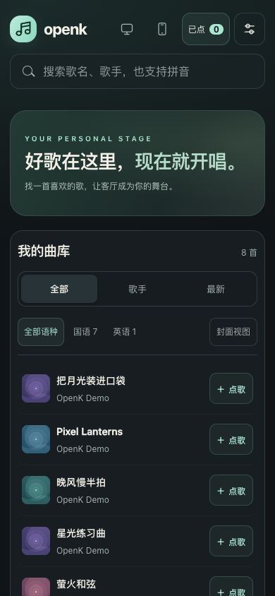
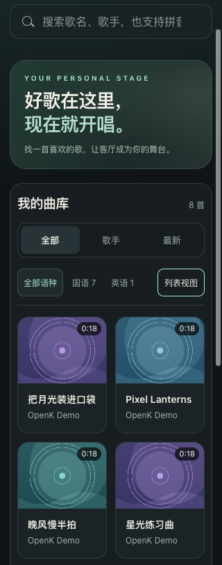

# OpenK 使用说明书

本说明对应 `main` 分支；稳定镜像请同时参考其版本标签下的文档。
首次安装见 [README](../README.md#用-docker-运行跨平台最省事)，
NAS 与算力机配置见[分布式部署](distributed.md)。

## 选一个入口

| 想做什么 | 打开哪里 | 声音与队列在哪里 |
| --- | --- | --- |
| 在电脑 / 平板上点歌、看歌词、录唱 | `/` | 当前浏览器播放，队列保存在当前浏览器 |
| 电视唱、手机点 | 电视 `/tv`，手机 `/remote` | 电视播放，房间队列由服务端保存 |
| 添加歌曲、查看制作进度 | 右上角「后台」或 `/admin` | 管理同一个服务端曲库 |

手机直接打开 `/` 是经典播放器，不等于电视遥控器。
需要控制电视时请使用 `/remote` 配对；两种队列不会自动互相复制。

## 第一次添加歌曲

1. 打开「后台」，粘贴有权使用的视频链接，选择识别语言后点「开始制作」。
2. 歌单链接使用「歌单」先预览，再勾选歌曲并点「导入选中」。
3. 服务端启用了本地媒体导入时会显示「本地文件」。这里只浏览服务端允许的目录，
   不是上传手机里的文件；选择条目后确认导入。
4. 观察下载、分离、歌词处理进度。完成的歌曲进入曲库，失败任务可检查错误并重试。

首次运行模型通常较慢；远程 worker 离线时，相关任务会排队等待。
查看后台进度不会切掉当前演唱的歌曲，不必为了等待制作而反复重新提交。

## 找歌和排队

搜索支持歌名、歌手、全拼、首字母以及空格组合，例如 `周杰伦 稻香`、`zjl dx`。
繁简、大小写、全半角可互通；不会自动猜测错别字或歌手别名。
在经典页面按 `/` 可聚焦搜索，输入中文组词时会等文字确认后再更新结果。

用「全部 / 歌手 / 最新」切换浏览方式，再用语种按钮缩小范围。
搜索时会跨歌手找歌，但保留语种筛选；结果过少时先检查语种是否选对。
「封面视图 / 列表视图」只改变展示，不改变曲库或队列。

在经典点歌台，点歌曲或「点歌」会加入已点队列；空闲时会尝试开始播放。
浏览器阻止自动播放时，请按播放按钮明确启用声音。
打开「已点」可调整顺序、移除歌曲或清空队列；这是修改待唱列表，不是删除曲库文件。

## 播放、歌词与混音

悬浮播放条可暂停、重唱、切到下一首、切换原唱 / 伴唱和打开队列。
点击播放条歌名展开歌词页；返回点歌台不会停止歌曲，可边唱边点。

| 控件 | 作用 |
| --- | --- |
| 伴唱 / 原唱 | 默认只放伴奏；原唱模式混入已分离的人声音轨 |
| 进度条 / 歌词行 | 拖动进度或点击歌词，跳到对应位置 |
| 伴奏 / 导唱人声 | 分别调整两条音轨的音量 |
| 麦克风 / 混响 | 调整监听与录唱效果；需要先授权麦克风 |
| 编辑歌词 | 修改文字并保存；未改文字的行尽量沿用原时间戳 |
| 搜歌词重对齐 | 从 LRCLIB 选正确歌词，后台重做对齐，不重新下载或分离 |

重对齐完成前继续使用原歌词；完成后切换新结果，失败不会把原歌词清空。
有「无词」标记的歌曲仍能播放伴奏，但没有可用字幕。
编辑文字不能保证修正整首的时间偏移，来源不对时优先搜索正确歌词重新对齐。

## 麦克风与录音

局域网设备通常需要 **HTTPS 和浏览器麦克风授权**；`localhost` 可使用 HTTP。
电视入口不申请麦克风权限，Fire TV 遥控器麦克风也不是浏览器录唱输入设备。

1. 在经典歌词页点击「开始录唱」，允许浏览器使用所选麦克风。
2. 建议先用耳机、小音量试听，再调整麦克风音量和混响。
3. 完成后停止录唱，等待上传；可在该歌曲的「我的录音」中回放、下载或删除录音。

录音绑定开始录唱时的歌曲，切歌不会把它挂到下一首。
上传失败会进入「录音保存中心」，可重试或下载备份；
**未保存的音频仍在当前页面内存里，不要关闭或刷新页面。**

「麦克风外放」默认勾选，但授权和音频引擎就绪后才生效。
切到后台会暂停监听，回到页面需明确恢复；这不会主动停止正在进行的录音。
防啸叫只辅助控制监听反馈，不能替代合理的音量、麦克风摆放或实机调试。

## 电视和手机一起唱

1. 电视打开 `/tv`；手机扫描二维码，或在 `/remote` 输入房间号与配对码。
2. 手机点歌后，电视上按「启用电视声音」。
3. 后续在手机上搜索、排队、暂停、重唱、切歌和切换原唱，声音仍从电视输出。

二维码在本地生成。房间凭据保存在浏览器里，刷新后可恢复配对，
但电视重载或唤醒后可能需要再次启用声音。
Fire TV 浏览器、遥控器及外部音响的限制见[电视指南](tv.md)。

## 常见问题

| 现象 | 先检查 |
| --- | --- |
| 找不到刚添加的歌 | 是否仍在处理、是否失败，以及当前搜索 / 语种筛选 |
| 点击后没有声音 | 浏览器播放授权、设备输出、伴奏音量；电视模式是否已启用电视声音 |
| 有伴奏但没有逐字歌词 | 是否标为无词、是否只有逐行歌词、对齐模型是否可用 |
| 无法使用麦克风 | HTTPS / localhost、站点权限、系统输入设备以及设备是否被占用 |
| 回到页面后听不到自己的声音 | 监听可能因页面隐藏暂停，使用「恢复麦克风外放」 |
| 录音没有保存 | 查看保存中心；先下载未保存音频，再排查网络和磁盘空间 |
| 两台设备的已点列表不同 | 是否误把经典 `/` 本地队列和 `/remote` 房间队列混用 |
| 命令行改了元数据，网页没变化 | 离线工具写盘后需重启 API 加载；仅刷新网页不会重新读 `status.json` |
| 页面仍是旧样式 | 先保存待上传录音，再刷新；确认运行的是目标版本，而非仍在旧稳定版 |

## 数据与维护边界

歌曲、分离结果、歌词和已上传录音保存在服务端持久目录；
浏览器会流式播放和缓存媒体，不是曲库的主存储。
NAS + worker 部署中，算力机只保留模型缓存和可清理的临时推理文件。

离线批量修改前备份数据、停止 API 和 worker；不要在演唱中直接改 `status.json`。
在线除重通过 API 删除淘汰任务，会连同这些任务的音轨、歌词和录音一起删除，
源文件移入 `_重复/` 也不等于完整备份。命令和预览 / 写入规则见
[程序与脚本索引](project-layout.md)。

当前没有全站账号登录；配对码不是后台的登录保护。
请仅用于可信网络，或放在认证反向代理后。见[安全说明](../SECURITY.md)。

本文截图均为虚构曲目、原创示例歌词与合成音轨；
[截图生成说明](screenshots/README.md)记录了可复现的素材来源。
